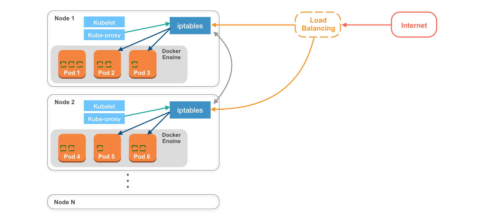
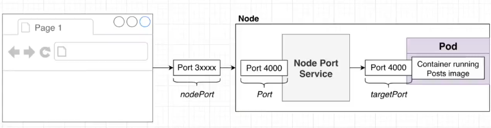

# **[Kubernetes 30天學習筆記](https://ithelp.ithome.com.tw/users/20103753/ironman/1590)**

+ # Day 01 - Intro

   - [Container 技術三部曲](https://www.ithome.com.tw/article/91838)

      - container: 以應用程式為中心的虛擬技術 （傳統虛擬化技術是以作業系統為中心）

      - 將應用程式所需要的程式碼、函式庫、環境配置檔都打包起來，並嚴格控管資源\
         → Control Group and Namespaces in Linux

         - Namrspace: 系統資源的使用名單（如何分配資源，給誰使用）

         - Control Group: 管理每一個 namespace 可以使用的資源

   - Kubernetes

      - 協助自動化部署、擴張、管理 containerized applications 的系統

      - 同時部署多個 containers 到一台或多台機器上

      - 管理 containers 的狀態，container 有問題的時候可以重啟，抱持服務

      - 轉移一台機器上的 containers 到另外一台機器上

   - Why use kubernetes

      - 過去單體架構（monolithic architecture）的服務之間關聯性複雜

      - 微服務架構（microservices）降低程式之間的複雜度\
         → 要如何管理微服務？

   - k8s 優點

      - can run anywhere（公有雲、私有雲、混合雲）

      - high modular （1 container = 1 service → 容易修改、擴張、遷移）

+ # Day 02 - Minikube

   - Steps

      1. install kubernetes-cli

         ```shell
         brew install kubernetes-cli
         ```

      2. install minikube

         ```shell
         brew install minikube
         ```

      3. install qemu

         ```shell
         brew install qemu
         ```

      4. set up qemu socker_vvmnet

         ```shell
         brew install socket_vmnet
         brew tap homebrew/services
         HOMEBREW=$(which brew) && sudo ${HOMEBREW} services start socket_vmnet
         ```

      5. start minikube with the Qemu driver and socket_vmnet

         ```shell
         minikube start --driver qemu --network socket_vmnet
         ```

      6. validate minukube setup

         - <https://devopscube.com/minikube-mac/>

         - nginx

            ```shell
            kubectl create deployment nginx --image=nginx
            kubectl expose deployment nginx --type=NodePort --port=80
            minikube service nginx --url
            # Click the url provided by the previous command (nginx welcome)
            ```

         - dashboard

            ```shell
            minikube dashboard
            ```

+ # Day 03 - Docker containers

   - create a node.js image

+ # Day 04 - Upload image to registry

   - upload image built to docker hub

+ # Day 05 - Minikube + containers

   - k8s 最小運行單位: Pod

   - k8s 上面會有很多 applications，1 pod = 1 application

   - Pod 特點：

      - pod 有自己的 yaml 檔

      - 一個 pod 裡面可以有一個或多個 docker container(s)

      - 同一個 pod 裡面的 containers 之間可以用 local port numbers 來相互溝通

   - create pod: first-pod.yaml

      ```yaml
      apiVersion: v1
      kind: Pod
      metadata:
        name: first-pod
        labels:
          role: first-pod
          app: web-server
          annotation: first-pod
      spec:
        containers:
          - name: first-pod
            image: cutechuanchuan/nodejs-example:1.0.0
            imagePullPolicy: Always
            ports:
              - containerPort: 3000
        
      ```

      ```shell
      kubectl create -f first-pod.yaml
      kubectl get pods
      kubectl describe pods first-pod
      ```

   - interact with pod

      1. kubectl port-forward: 將 pod port & local port 做 mapping

         ```shell
         kubectl port-forward first-pod 8000:3000
         ```

      2. create service: 將 pod port & k8s cluster port 做 mapping

         ```shell
         kubectl expose pod first-pod --type=NodePort --name=first-pod-service
         kubectl get services
         minikube service first-pod-service --url
         ```

   - common command

      ```shell
      kubectl get pods
      kubectl get pods --show-all
      kubectl describe pod <pod>  
      
      kubectl expose pod <pod> --port=<port> --name=<service-name>
      kubectl port-forward <pod> <external-port>:<pod-port>
      
      kubectl exec <pod> -- <command>
      
      kubectl get pod --show-labels
      kubectl label pods <pod> <label-key>=<label-value>
      
      kubectl describe pod first-pod # can find ip
      
      kubectl run -i --tty alpine --image=alpine --restart=Never -- sh
      apk add --no-cache curl
      curl http://ip:port
      ```

+ # Day 06 - Node

   - Node: 一台機器 （實體、虛擬，筆電、EC2）

   - 一個 Node 裡面可以有一個或多個 pod
      
   - Some concepts

      1. 同一個 pod 中的 containers，可以透過 pod 內部的網路直接溝通\
         <[localhost](localhost):port_num>

      2. Kubelet & kube-proxy

         1. kubelet: node agent，管理 node 中的所有 pods，與 master node 即時溝通

         2. kube-proxy: 將 node 中所有的 pods 資訊傳給 iptables，讓 pod 可以被其他物件存取

+ # Day 07 - Replication controller (scaling)

   - Stateless v.s stateful

      - stateless

         - application 不會因為時間、其他資料、其他 request 而影響回傳的資料

         - e.g., web application

      - stateful

         - 每次回傳的資料會受到之前的行為而有所不同

         - e.g., database

   - replication controller

      - 可以有自己的 yaml 設定檔

         ```yaml
         apiVersion: v1
         kind: ReplicationController
         metadata:
           name: first-replication-controller
         spec:
           replicas: 3 # num of pods
           selector:
             app: web-server # conditions to select pod (based on pod labels)
           template:
             metadata:
               labels:
                 app: web-server # assigning pod's lable; otherwise, error
             spec: # defining container
               containers:
                 - name: first-pod
                   image: cutechuanchuan/nodejs-example:1.0.0
                   imagePullPolicy: Always
                   ports:
                     - containerPort: 3000
               restartPolicy: Always
         ```

      - 管理 pod 的數量跟狀態

         - 可以設定同時有多少個相同的 pod 運行在 cluster 上

         - pod crashes or fails 時，controller 會加以偵測並且自動創建新的 pod\
            → 確保 pod 運行的數量跟設定檔的數量相同

         - 機器重啟時，controller 會自動建立，確保 pod 隨時都在運行

      - common command

         ```yaml
         kubectl get pods
         
         kubectl create -f first-controller.yaml
         kubectl get rc
         kubectl get pods --show-labels
         kubectl describe pods <pod name>
         
         kubectl delete pods <pod name>
         kubectl scale --replicas=4 -f first-controller.yaml
         kubectl describe rc first-replication-controller
         
         kubectl delete rc my-replication-controller
         kubectl delete rc my-replication-controller --cascade=false
         ```

      - application 經常會 rollout & rollback\
         → replication controller 還是有手動的部分\
         → 使用 'deployment'
   

+ # Day 08 - Deployment

   - [official note](https://kubernetes.io/docs/concepts/workloads/controllers/replicationcontroller/): A Deployment that configures a ReplicaSet is now the recommended way to set up replication.

   - ReplicaSet  = 進化版的 ReplicationController\
      → 有更彈性的 selector

   - 不建議使用 kubectl create 來創建 replica set\
      → 透過 deployment

      - 優點：

         1. 部署應用服務 (application)

         2. 協助 application 升級到特定版本

         3. zero downtime deployment

         4. be able to rollbakc to previous version

   - yaml

      ```yaml
      apiVersion: apps/v1
      kind: Deployment
      metadata:
        name: first-deployment
        labels:
          app: web-server-deployment
      spec:
        replicas: 3
        selector:
          matchLabels:
            app: web-server
            env: dev
        template:
          metadata:
            labels:
              app: web-server
              env: dev
              version: v2
          spec:
            containers:
              - name: first-pod
                image: cutechuanchuan/nodejs-example:2.0.0
                imagePullPolicy: Always
                ports:
                  - containerPort: 3000
            restartPolicy: Always
            
      ```

   - common commands

      ```yaml
      kubectl get all --show-labels
      kubectl apply -f first-deployment.yaml
      kubectl describe replicasets.apps <deployment name>
      kubectl expose deployments.apps <deployment name> --type=NodePort --name=first-deployment-v2
      minikube service first-deployment-v2 --url
      
      kubectl set image deploy/ <deployment-name> <pod-name>: <image-path>: <version>	
      kubectl rollout status deploy <deployment-name>
      kubectl rollout history deploy <deployment-name>
      kubectl rollout undo deploy <deployment-name>
      kubectl rollout undo deploy <deployment-name> --to-revision=n
      
      kubectl edit deploy <deployment name>
      kubectl set image deployments.apps/first-deployment first-pod=cutechuanchuan/nodejs-example:2.0.0 --record
      ```

+ # Day 09 - Services

   - pod 的生命週期非常動態\
      → 需要橋樑來確保 end users or other applications 可以連線到升級後的 pod 

   - services 類型

      1. ClusterIP：

         - 功能：預設的 Service 類型。它創建一個內部的 ClusterIP，讓 cluster 內部的其他服務可以通過這個 ClusterIP 訪問正在運行的 Pods。

         - 使用場景：集群內部通信，不對外部公開。

      2. NodePort：

         - 功能：在每個節點（Node）上打開一個特定的端口（NodePort），使集群外部但在同一個網絡中的設備可以通過這個端口訪問集群內的服務。

         - 使用場景：允許集群外部的用戶通過每個節點上的特定端口訪問服務，通常在測試或開發環境中使用。

      3. LoadBalancer：

      - 功能：如果 Kubernetes 集群運行在支持 LoadBalancer 的雲平台上，例如 AWS 或 GCP，這種類型的服務會自動創建一個外部負載均衡器，並將流量分發到後端的所有節點。

      - 使用場景：對外公開服務，並需要自動處理流量分發和負載均衡。

   - yaml

      - port: the port **of this service**

      - target port: the port on the node where external traffic will come in on

      - nodeport: the target port on the pod(s) to forward traffic to

         - 介於 3000 \~ 32367

         - 可以修改 nodeport range

      - <https://stackoverflow.com/a/67161567>

         

         ```yaml
         kubectl create -f first-service.yaml
         kubectl run -i --tty alpine --image=alpine --restart=Never -- sh
         
         apk add --no-cache curl
         curl <ip of service:port>
         
         ```

      - 除非於設定檔設定 cluster IP，否則每次 service 重新建立都會是隨機指定 IP\
         → 若今天有兩個服務，一個 app，一個 db\
         → 都各自用 deployment，並使用 service 提供服務\
         → 在不修改設定檔的狀況下，app 要如何找到 db service 動態產生的 virtual IP\
         → 仰賴 service discovery (day 17)

+ # Day 10 - Labels

   - labels: 具有辨識度的 key=value

      - 使用對象

         - pods

         - nodes (label nodes and add nodeSelector on pods)

         ```yaml
         kubectl label pod pod-with-label env=dev
         ```

      - examples

         - "release" : "stable"\
            "release" : "qa"

         - "enviroment": "dev"\
            "enviroment": "production"

         - "tier": "backend"\
            "tier": "frontend"

         - "department": "enginnerting"\
            "department": "marketing"\
            "department": "finance"

      - 每個物件可以同時有多個 labels

      - 可以透過 selector 縮小要尋找的物件，也可以透過 matchExpressions 增加彈性

   - annotations: 沒有識別用途的標籤

      - 方便開發者、以及系統管理者管理上的方便，不會直接被 Kubernetes使用

      - examples

         - 該 Pod的發行時間，發行版本，聯絡人email

+ # Day 11 - Health check

   - 確保 containers 的運行狀態\
      → 遇到異常，restart container，以確保服務正常運行

   - 常見的 health check

      - 定期透過指令訪問 container

      - 定期發送 http request 給 containers

      - 通常在實際場景中(Production Environment)，會有一個專門來回應 health check 的 endpoint，例如 `/health` 來確認 application 是否正常運作。

   - [resources](https://kubernetes.io/docs/tasks/configure-pod-container/configure-liveness-readiness-startup-probes/)

+ # Day 12 - Secrets

   - k8s 存取敏感資訊的方式

   - Ways to create secrets

      - command

         - common commands

            ```bash
            kubectl create secret generic demo-secret \
            --from-file password.txt --from-file username.txt
            
            kubectl create secret generic demo-secret-lit \
            --from-literal=phone=0932110110
            ```

      - yaml

         - 需要先採 base64 encoding

            ```yaml
            apiVersion: v1
            kind: Secret
            metadata:
              name: secret-from-yaml-encode
            type: opaque
            stringData:
              username: cm9vdA==
              password: cm9vdHBhc3M=
            ```

   - Ways to mount secrets to pods

      - secrets → environment variables

         ```yaml
         apiVersion: v1
         kind: Pod
         metadata:
           name: pod-secret-way1
           labels:
             app: web-server-secret-way1
         spec:
           containers:
             - name: pod-secret-way1
               image: cutechuanchuan/nodejs-example:2.0.0
               imagePullPolicy: Always
               ports:
                 - containerPort: 3000
               env:
                 - name: SECRET_USERNAME
                   valueFrom:
                     secretKeyRef:
                       name: secret-from-yaml-encode
                       key: username
                 - name: SECRET_PASSWORD
                   valueFrom:
                     secretKeyRef:
                       name: secret-from-yaml-encode
                       key: password
         
           restartPolicy: Always
         ```

      - secrets file mounted to certain path of pods

         ```yaml
         apiVersion: v1
         kind: Pod
         metadata:
           name: pod-secret-way2
           labels:
             app: web-server-secret-way2
         spec:
           containers:
             - name: pod-secret-way2
               image: cutechuanchuan/nodejs-example:2.0.0
               imagePullPolicy: Always
               ports:
                 - containerPort: 80
               volumeMounts:
                 - mountPath: /etc/secret
                   name: secret-volume
                   readOnly: true
           volumes:
             - name: secret-volume
               secret:
                 secretName: secret-from-yaml-encode
           restartPolicy: Always
         ```

   

+ # Day 13 - Stateless Wordpress

   
